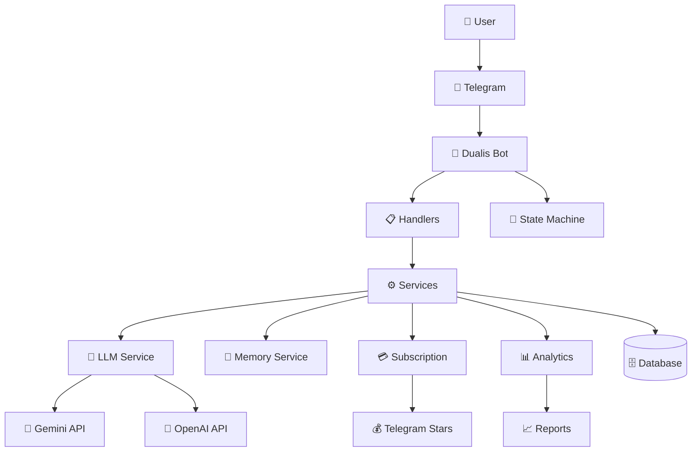
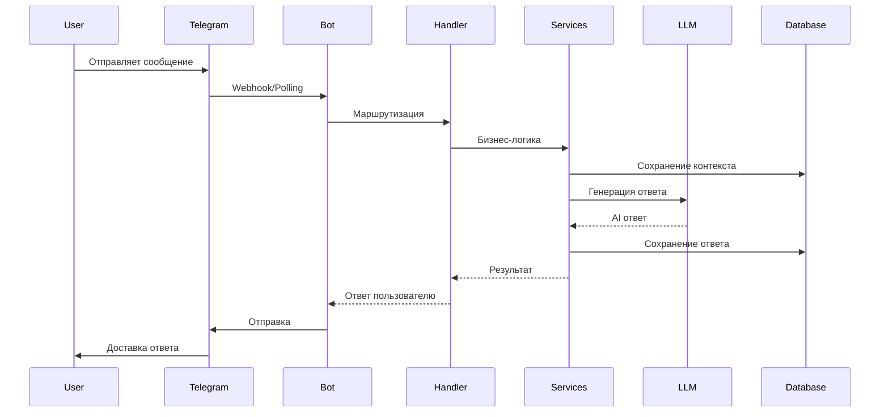

# Dualis AI Companion Bot - Architecture Documentation

## Обзор

Dualis представляет собой многоуровневую архитектуру Telegram-бота с AI-персонами, построенную на современном Python стеке с акцентом на масштабируемость и модульность.

## Компоненты

### Core Bot Framework
- **Описание**: Основа бота на aiogram 3.x
- **Ответственность**: Обработка Telegram API, маршрутизация сообщений, FSM
- **Технологии**: aiogram 3.x, asyncio
- **Файлы**: `main.py`, `handlers/`

### Database Layer
- **Описание**: Слой данных с ORM и миграциями
- **Ответственность**: Хранение пользователей, сообщений, подписок, аналитики
- **Технологии**: SQLAlchemy 2.x, Alembic, SQLite/PostgreSQL
- **Файлы**: `database/models.py`, `database/operations.py`, `alembic/`

### AI Services
- **Описание**: Интеграция с LLM и обработка AI-логики
- **Ответственность**: Генерация ответов, управление контекстом, персоны
- **Технологии**: Gemini API, OpenAI API
- **Файлы**: `services/llm_service.py`, `services/memory_service.py`, `personas/`

### Business Logic Services
- **Описание**: Бизнес-логика подписок, платежей, аналитики
- **Ответственность**: Subscription management, payments, A/B testing, notifications
- **Технологии**: Telegram Stars, промокоды, реферальная система
- **Файлы**: `services/subscription_system.py`, `services/promocode_system.py`, `services/referral_ab_testing.py`

### Monitoring & Analytics
- **Описание**: Мониторинг производительности и бизнес-аналитика
- **Ответственность**: Метрики, алерты, ML-предсказания, отчеты
- **Технологии**: Structured logging, ML models
- **Файлы**: `monitoring/`, `analytics/`, `reporting/`

## Архитектурные решения (ADR)

### ADR-001: Выбор aiogram 3.x
**Дата**: 2024-12-19
**Статус**: Принято
**Контекст**: Необходим современный фреймворк для Telegram Bot API
**Решение**: Использование aiogram 3.x
**Обоснование**: 
- Нативная поддержка asyncio
- Современный FSM
- Активная поддержка сообщества
- Хорошая документация
**Последствия**: 
- ✅ Высокая производительность
- ✅ Современные возможности Python
- ⚠️ Требует изучения новой версии API
**Теги**: #framework #telegram #core

### ADR-002: SQLAlchemy 2.x + Alembic
**Дата**: 2024-12-19
**Статус**: Принято
**Контекст**: Необходима надежная система управления БД
**Решение**: SQLAlchemy 2.x с Alembic для миграций
**Обоснование**:
- Современный async ORM
- Профессиональные миграции
- Поддержка множества СУБД
- Type safety
**Последствия**:
- ✅ Надежность и масштабируемость
- ✅ Простота миграций
- ⚠️ Сложность настройки
**Теги**: #database #orm #migrations

### ADR-003: Модульная архитектура сервисов
**Дата**: 2024-12-19
**Статус**: Принято
**Контекст**: Необходимость разделения ответственности
**Решение**: Разделение на независимые сервисы в папке services/
**Обоснование**:
- Принцип единственной ответственности
- Легкость тестирования
- Возможность независимого развития
**Последствия**:
- ✅ Чистая архитектура
- ✅ Простота поддержки
- ⚠️ Больше файлов для управления
**Теги**: #architecture #services #modularity

### ADR-004: Gemini API как основной LLM
**Дата**: 2024-12-19
**Статус**: Принято
**Контекст**: Выбор LLM провайдера для AI-персон
**Решение**: Google Gemini API как основной, OpenAI как fallback
**Обоснование**:
- Хорошее соотношение цена/качество
- Поддержка multimodal
- Высокие лимиты
**Последствия**:
- ✅ Экономичность
- ✅ Современные возможности
- ⚠️ Зависимость от Google
**Теги**: #llm #ai #integration

## Диаграммы

### Архитектура высокого уровня

### Поток обработки сообщений

## Потоки Данных

### Основные потоки
1. **User Input Flow**: Telegram → Bot → Handlers → Services → Database
2. **AI Response Flow**: Services → LLM API → Context Processing → Response Generation
3. **Analytics Flow**: All Services → Analytics Service → Database → Reports
4. **Subscription Flow**: Payment Events → Subscription Service → Database → User Permissions

### Критические зависимости
- **Database**: Центральное хранилище всех данных
- **LLM APIs**: Критичны для основного функционала
- **Telegram API**: Единственный канал взаимодействия с пользователями

## Масштабируемость

### Текущие ограничения
- SQLite для разработки (не подходит для продакшена)
- Синхронная обработка некоторых операций
- Отсутствие кеширования

### Планы развития
- Переход на PostgreSQL для продакшена
- Внедрение Redis для кеширования
- Горизонтальное масштабирование через webhook'и
- Микросервисная архитектура для отдельных компонентов